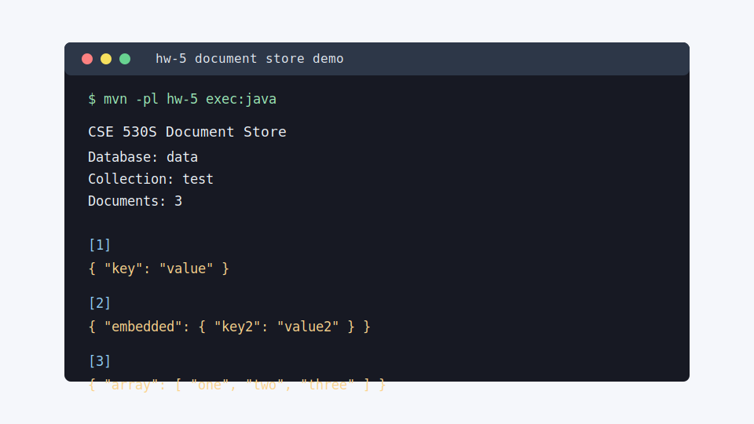

# CSE 530S Databases Coursework

This repository contains Java coursework from a databases class. It is organized as separate homework snapshots rather than a single production application. The assignments explore the core pieces of a small database system: heap-file storage, tuple schemas, relational operators, B+ tree indexing, buffer-pool behavior, and a small JSON document store.

The maintained, buildable module is `hw-5`, a file-backed document database assignment. The earlier `hw-1-4-A` and `hw-1-4-B` directories are preserved as legacy coursework snapshots with instructor and student test files, but they still contain assignment stubs and are not wired into the automated CI gate.

## Repository Layout

| Path | Purpose | Current status |
| --- | --- | --- |
| `hw-1-4-A/` | Earlier database engine homework snapshot covering heap files, tuples, relational operators, B+ trees, and buffer-pool APIs. | Legacy coursework snapshot. Contains JUnit 4 tests, but many implementation stubs remain. |
| `hw-1-4-B/` | Alternate or later snapshot of the same homework sequence with additional tests and fixture files. | Legacy coursework snapshot. Contains JUnit 4 tests, but many implementation stubs remain. |
| `hw-5/` | JSON document-store homework with `DB`, `DBCollection`, `DBCursor`, and `Document` classes. | Maintained Maven module with JUnit 5 unit tests and JaCoCo coverage. |
| `.github/workflows/ci.yml` | GitHub Actions pipeline for tests and code scanning. | Runs on `main`, `dev`, and pull requests targeting those branches. |
| `.github/dependabot.yml` | Dependabot update automation for Maven dependencies and GitHub Actions. | Opens grouped weekly update pull requests. |

## What The Code Does

### `hw-5` Document Store

The `hw-5` module implements a simple local JSON document database:

- `DB` maps a database name to a directory under `hw-5/testfiles/`.
- `DBCollection` maps a collection name to a `.json` file inside the database directory.
- `Document` converts between JSON text and Gson `JsonObject` instances.
- `DBCursor` implements Java's `Iterator<JsonObject>` over query results.
- `DocumentStoreCli` provides a tiny command-line interface for viewing a collection.

Documents are stored as JSON objects separated by a line containing a tab character, matching the original assignment fixture format.

Supported operations include:

- Create and drop databases.
- Create, drop, and count collections.
- Insert JSON documents with generated `_id` values when one is not provided.
- Read a document by index.
- Find all documents.
- Find documents by exact top-level field equality.
- Project selected fields.
- Replace matching documents.
- Remove one or many matching documents.

### Legacy Homework Snapshots

The `hw-1-4-A` and `hw-1-4-B` directories preserve earlier assignment materials. Their source trees include packages such as:

- `hw1`: tuple descriptors, tuple fields, catalogs, heap pages, heap files, and database globals.
- `hw2`: relations, relational operators, SQL query parsing helpers, and aggregation hooks.
- `hw3`: B+ tree node, leaf, inner-node, and entry classes.
- `hw4`: buffer-pool and permissions classes.
- `src/test`: JUnit 4 tests from the assignment sequence.

These folders are useful as coursework reference material, but they are intentionally excluded from the required CI test command because they still contain many `your code here` stubs.

## Command-Line Interface

The maintained module includes a small CLI for inspecting the sample document collection:



Run it with:

```bash
mvn -pl hw-5 exec:java
```

Optional arguments select a database and collection:

```bash
mvn -pl hw-5 exec:java -Dexec.args="data test"
```

## Unit Tests

The canonical unit test command is:

```bash
mvn verify
```

That command runs the `hw-5` JUnit 5 test suite and enforces at least 90% line coverage through JaCoCo.

Useful focused commands:

```bash
mvn -pl hw-5 test
mvn -pl hw-5 verify
```

Test files live in `hw-5/src/test/`. The suite covers:

- JSON parsing and serialization validation.
- Database directory creation and deletion.
- Collection creation and document reads.
- Insert, count, generated IDs, update, and remove behavior.
- Cursor iteration, query filtering, and projection.
- The original assignment fixture in `hw-5/testfiles/data/test.json`.

Coverage output is generated at:

```text
hw-5/target/site/jacoco/index.html
```

## GitHub Actions Pipeline

The workflow in `.github/workflows/ci.yml` runs for pushes to `main` and `dev`, and for pull requests targeting `main` or `dev`.

### Unit Tests

The `Unit Tests` job:

- Checks out the repository.
- Sets up Temurin Java 17.
- Enables Maven dependency caching.
- Runs `mvn --batch-mode verify`.
- Uploads the JaCoCo HTML report as a workflow artifact.

### Code Scanning: Quality

The `Code Scanning / Quality` job uses GitHub CodeQL with the `security-and-quality` query suite. Findings are published to GitHub's code scanning interface when code scanning is enabled for the repository.

### Code Scanning: Security

The `Code Scanning / Security` job uses GitHub CodeQL with the `security-extended` query suite for Java. The separate `Code Scanning / Security / Dependency Review` job runs on pull requests and checks dependency changes for known vulnerabilities and policy issues.

CodeQL and dependency review are GitHub-native features documented by GitHub for code scanning, Java Maven builds, and supply-chain review:

- [CodeQL code scanning](https://docs.github.com/en/code-security/concepts/code-scanning/codeql/codeql-code-scanning)
- [Building and testing Java with Maven](https://docs.github.com/en/actions/tutorials/build-and-test-code/java-with-maven)
- [Dependabot version updates](https://docs.github.com/en/code-security/concepts/supply-chain-security/dependabot-version-updates)

### Dependency Automation

Dependabot is configured to check:

- Maven dependencies from the root project.
- GitHub Actions used by workflows.

It opens grouped weekly pull requests so maintenance updates remain organized.

## Local Requirements

- Java 11 or newer for the Maven build configuration.
- Maven 3.8 or newer.

GitHub Actions uses Java 17.

## Notes For Future Work

- Finish the legacy `hw-1-4-A` and `hw-1-4-B` assignment stubs before adding those folders to the required CI test matrix.
- If this repository is private, confirm that CodeQL/code scanning and dependency review are available for the account or organization plan.
- Native GitHub secret scanning and push protection are best enabled in repository settings because their availability depends on repository visibility and account settings.
